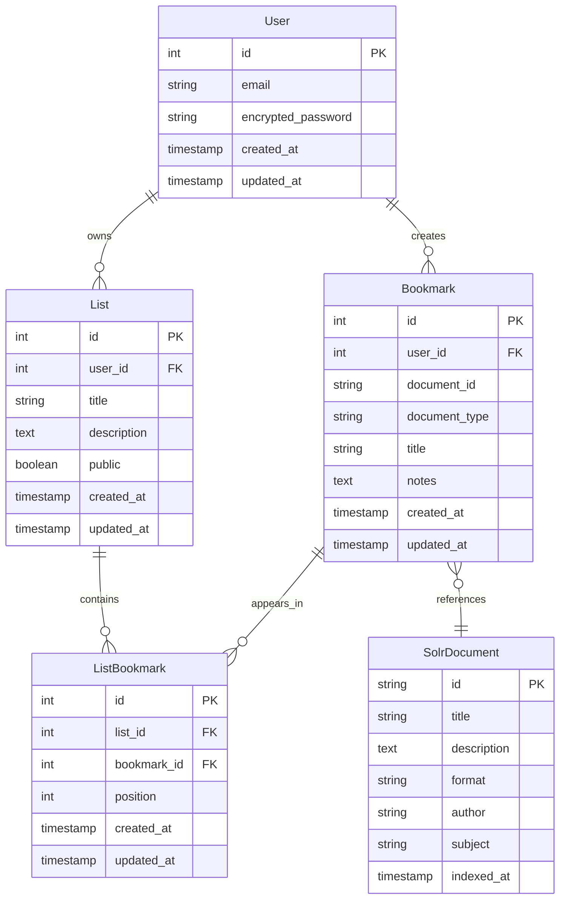

```mermaid
erDiagram
    User {
        int id PK
        string email
        string encrypted_password
        timestamp created_at
        timestamp updated_at
    }
    
    List {
        int id PK
        int user_id FK
        string title
        text description
        boolean public
        timestamp created_at
        timestamp updated_at
    }
    
    Bookmark {
        int id PK
        int user_id FK
        string document_id
        string document_type
        string title
        text notes
        timestamp created_at
        timestamp updated_at
    }
    
    ListBookmark {
        int id PK
        int list_id FK
        int bookmark_id FK
        int position
        timestamp created_at
        timestamp updated_at
    }
    
    SolrDocument {
        string id PK
        string title
        text description
        string format
        string author
        string subject
        timestamp indexed_at
    }
    
    User ||--o{ List : "owns"
    User ||--o{ Bookmark : "creates"
    List ||--o{ ListBookmark : "contains"
    Bookmark ||--o{ ListBookmark : "appears_in"
    Bookmark }o--|| SolrDocument : "references"
```
