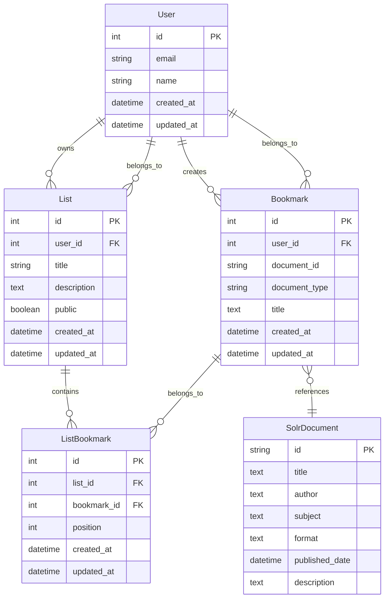

```mermaid
erDiagram
    User {
        int id PK
        string email
        string name
        datetime created_at
        datetime updated_at
    }
    
    List {
        int id PK
        int user_id FK
        string title
        text description
        boolean public
        datetime created_at
        datetime updated_at
    }
    
    Bookmark {
        int id PK
        int user_id FK
        string document_id
        string document_type
        text title
        datetime created_at
        datetime updated_at
    }
    
    ListBookmark {
        int id PK
        int list_id FK
        int bookmark_id FK
        int position
        datetime created_at
        datetime updated_at
    }
    
    SolrDocument {
        string id PK
        text title
        text author
        text subject
        text format
        datetime published_date
        text description
    }
    
    User ||--o{ List : "owns"
    User ||--o{ Bookmark : "creates"
    List ||--o{ ListBookmark : "contains"
    Bookmark ||--o{ ListBookmark : "belongs_to"
    Bookmark }o--|| SolrDocument : "references"
    
    %% Additional relationships
    List }o--|| User : "belongs_to"
    Bookmark }o--|| User : "belongs_to"
```
